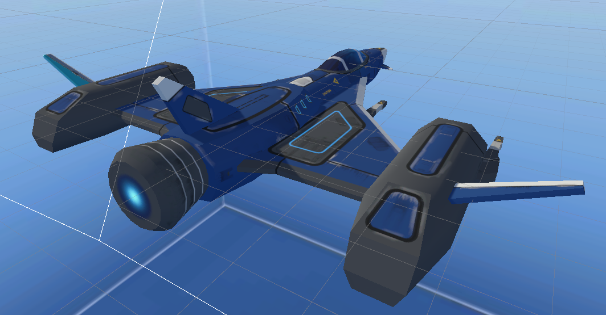
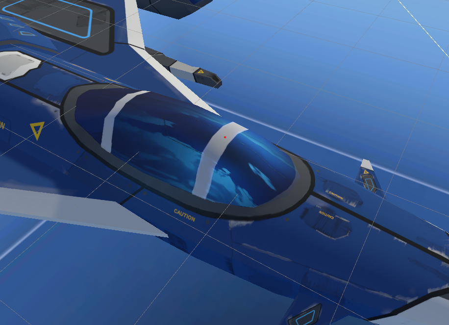

# ICG_Midterm
By Gabe Kotton  100817029

## Packages Used:
Unity's Cinemachine (Make the scene more dynamic)

Unity's New Input System (Make my life easier)

Star Sparrow SpaceShips (Cool space ships that I used in last proj)
https://assetstore.unity.com/packages/3d/vehicles/space/star-sparrow-modular-spaceship-73167

Sky box: https://favpng.com/png_view/sky-cloud-skybox-texture-mapping-cube-mapping-png/xdm2i8MN

## Shaders:
Toon ramp shader, it's very hard to notice, but it does (compared to original) look a lot more like a toy.
This is also thanks to the normals, but the toon ramp changes the way it's affected by shadows
. The toon ramp here is a circular toon ramp, but I'm not sure if it made any difference. I was just curious

This is the worldRefl shader used for the cock-pit of the ship. It's combined with the toon shader, but only applies to the cockpit.
It specifically uses a metallic and cubemap world box in order to semi-accurately reflect baked asset in the scene

### Notes: 
* I wanted to do the hurt thing, the code is there, I jsut ran out of time... Maybe if I had another hour or so, I could implement a slight roll to the ship and better lightining, camera placement etc.
* The bullets are light sources, so you can test the toon ramp and metallic properties this way
